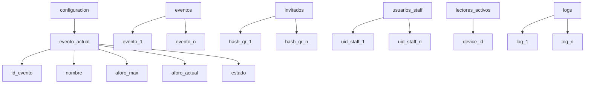
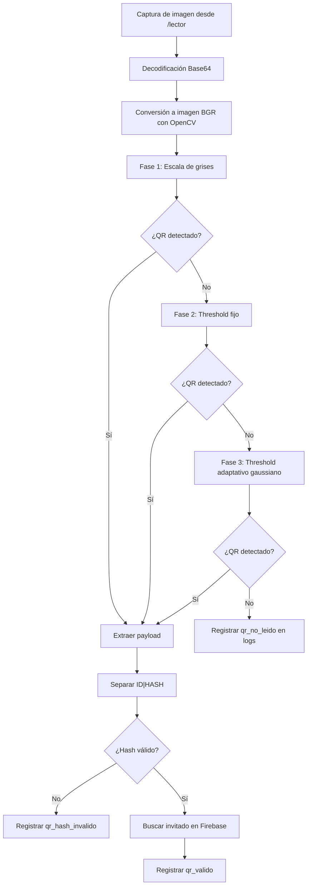

# Apéndice Técnico del Proyecto SIGA

## Presentación del apéndice

El presente apéndice reúne la documentación técnica complementaria del proyecto **SIGA**, con énfasis en aquellos elementos que justifican su complejidad de desarrollo, su reproducibilidad y su capacidad de auditoría. A diferencia de un anexo compuesto únicamente por archivos sueltos, esta sección organiza la información conforme a la lógica funcional del sistema y a los componentes que intervienen en la operación real del software.

Para la elaboración de este apéndice se revisaron directamente los archivos fuente del repositorio, en particular `qr_lector.py`, `sync.py`, `rutas.py`, `funciones_extras.py`, `firebase.py`, `app.py`, `api/index.py`, `requirements.txt`, `vercel.json`, `templates/admin.html` y `templates/lector.html`. Por ello, el contenido descrito a continuación corresponde a la implementación efectivamente presente en el proyecto.

## 1. Código fuente de los módulos críticos

### 1.1 Módulo de Procesamiento Digital de Imágenes: `qr_lector.py`

El módulo `qr_lector.py` implementa la lógica de decodificación del código QR. Su importancia radica en que no se limita a un único intento de lectura, sino que aplica un pipeline secuencial de tres fases para mejorar la robustez del reconocimiento en condiciones de iluminación o contraste variables.

Las fases implementadas son las siguientes:

1. Conversión de la imagen a escala de grises.
2. Aplicación de umbralización fija.
3. Aplicación de umbralización adaptativa gaussiana.

Este diseño incrementa la probabilidad de lectura exitosa antes de descartar una imagen como no legible. El sistema devuelve tanto el contenido del QR como la fase exitosa, lo cual permite registrar posteriormente la trazabilidad del proceso en los logs de auditoría.

#### Fragmento de código relevante

```python
import cv2
from typing import Optional

def decodificar_qr(imagen):
    detector = cv2.QRCodeDetector()
    texto, _puntos, _rectificado = detector.detectAndDecode(imagen)
    if not texto:
        return None
    return texto.strip() or None


def _procesar_con_detector(imagen) -> Optional[str]:
    return decodificar_qr(imagen)


def pipeline_decodificacion(imagen_bgr):
    """
    Orden obligatorio:
    1) Grises
    2) Threshold fijo
    3) Threshold adaptativo gaussiano
    """
    gris = cv2.cvtColor(imagen_bgr, cv2.COLOR_BGR2GRAY)
    texto = _procesar_con_detector(gris)
    if texto:
        return texto, "Fase 1: Escala de grises"

    _, fijo = cv2.threshold(gris, 127, 255, cv2.THRESH_BINARY)
    texto = _procesar_con_detector(fijo)
    if texto:
        return texto, "Fase 2: Threshold fijo"

    adaptativo = cv2.adaptiveThreshold(
        gris,
        255,
        cv2.ADAPTIVE_THRESH_GAUSSIAN_C,
        cv2.THRESH_BINARY,
        31,
        2,
    )
    texto = _procesar_con_detector(adaptativo)
    if texto:
        return texto, "Fase 3: Threshold adaptativo gaussiano"

    return None, None
```

#### Interpretación técnica

La función `pipeline_decodificacion()` recibe una imagen en formato BGR, la transforma y prueba sucesivamente tres estrategias de lectura. Si una fase logra decodificar el contenido, el proceso se detiene y devuelve el texto junto con la etapa que resultó exitosa. Si ninguna fase obtiene un resultado válido, la función retorna `None, None`, permitiendo a la capa de rutas reportar el evento como `qr_no_leido`.

#### Integración con la ruta de validación

El pipeline se integra dentro de la ruta `/validar_qr`, donde la imagen capturada desde el lector es decodificada y su fase exitosa se almacena en la bitácora del sistema:

```python
payload, fase = qr_lector.pipeline_decodificacion(imagen_bgr)

if not payload:
    evento = funciones_extras.append_lector_to_log(
        {"evento": "qr_no_leido", "fase_exitosa": None, "id_evento": event_id},
        lector,
    )
    sync.guardar_log(evento)
    return jsonify({"ok": False, "error": "QR no legible", "fase_exitosa": None}), 400

evento = funciones_extras.append_lector_to_log(
    {
        "evento": "qr_valido",
        "invitado_id": invitado_id,
        "id_evento": event_id,
        "fase_exitosa": fase,
        "fase_pdi": fase,
        "nombre_invitado": invitado.get("nombre_lider") or invitado.get("nombre") or invitado_id,
    },
    lector,
)
```

Desde el punto de vista de ingeniería, esta integración es relevante porque enlaza procesamiento de imagen, validación de negocio y auditoría operativa en una misma transacción lógica.

### 1.2 Módulo de resiliencia y sincronización: `sync.py`

El archivo `sync.py` implementa un mecanismo de tolerancia a fallos orientado a escenarios híbridos. Cuando Firebase se encuentra disponible, los eventos se escriben directamente en el nodo `logs`. Si la operación falla, el sistema almacena el registro en una cola local denominada `pendientes.json`. Posteriormente, un worker en segundo plano intenta reenviar dichos elementos a la nube.

Esta estrategia evita la pérdida de trazabilidad durante interrupciones de conectividad y permite que el sistema continúe operando en condiciones degradadas.

#### Fragmento de código relevante

```python
import os
import json
import time
from datetime import datetime, timezone
import firebase
import funciones_extras

PENDIENTES_FILE = os.getenv("PENDIENTES_FILE", "pendientes.json")
IS_SERVERLESS = os.getenv("VERCEL") == "1" or os.getenv("AWS_LAMBDA_FUNCTION_NAME") is not None
sync_meta = {"last_attempt": None, "last_success": None, "last_error": None}

def guardar_log(evento):
    """Intenta guardar en Firebase; si falla, guarda en cola offline."""
    evento.setdefault("timestamp", datetime.now(timezone.utc).isoformat())

    if firebase.firebase_ready:
        try:
            firebase.db.reference("logs").push(evento)
            return
        except Exception as exc:
            print(f"[WARN] Fallo guardando en Firebase, se encola: {exc}")

    if IS_SERVERLESS:
        print("[WARN] Firebase no disponible en serverless; no se persiste cola offline.")
        return

    pendientes = leer_pendientes()
    evento["sincronizado"] = False
    pendientes.append(evento)
    escribir_pendientes(pendientes)

def sincronizar_pendientes():
    stats = {"processed": 0, "synced": 0, "failed": 0}
    if not firebase.firebase_ready:
        return stats

    pendientes = leer_pendientes()
    if not pendientes:
        return stats

    actualizado = []
    for item in pendientes:
        if item.get("sincronizado") is True:
            actualizado.append(item)
            continue

        stats["processed"] += 1
        try:
            payload = dict(item)
            payload.pop("sincronizado", None)
            firebase.db.reference("logs").push(payload)
            item["sincronizado"] = True
            stats["synced"] += 1
        except Exception as exc:
            print(f"[WARN] No se pudo sincronizar item pendiente: {exc}")
            stats["failed"] += 1

        actualizado.append(item)

    escribir_pendientes(actualizado)
    return stats

def worker_sincronizacion():
    if IS_SERVERLESS:
        return
    while True:
        try:
            sync_meta["last_attempt"] = funciones_extras.now_iso()
            stats = sincronizar_pendientes()
            if stats.get("failed", 0) == 0:
                sync_meta["last_success"] = funciones_extras.now_iso()
                sync_meta["last_error"] = None
            else:
                sync_meta["last_error"] = f"Fallos de sincronización: {stats.get('failed', 0)}"
        except Exception as exc:
            print(f"[ERROR] Worker sync: {exc}")
            sync_meta["last_error"] = str(exc)
        time.sleep(30)
```

#### Comportamiento operativo

La lógica de sincronización se puede resumir de la siguiente manera:

1. Cada evento relevante se intenta registrar primero en Firebase.
2. Si ocurre un fallo, el evento se anexa a `pendientes.json`.
3. El worker `worker_sincronizacion()` se ejecuta cada 30 segundos.
4. Cuando la conexión vuelve a estar disponible, los eventos pendientes se reenvían y marcan como `sincronizado = true`.

#### Estructura esperada de la cola local

En el estado actual del repositorio, el archivo `pendientes.json` existe y se encuentra inicializado como una lista vacía:

```json
[]
```

No obstante, cuando el sistema trabaja en modo degradado, cada elemento puede tomar una estructura como la siguiente:

```json
[
  {
    "evento": "ingreso_registrado",
    "invitado_id": "20240001",
    "id_evento": "ev_2026_graduacion",
    "cantidad_entrada": 2,
    "fase_pdi": "Fase 2: Threshold fijo",
    "modo_conexion": "local",
    "dispositivo_id": "device_norte_01",
    "timestamp": "2026-04-13T18:20:00+00:00",
    "sincronizado": false
  }
]
```

Este diseño es significativo porque desacopla la operación del lector respecto de la disponibilidad inmediata del backend remoto.

### 1.3 Validación criptográfica del QR y control de integridad

La validación criptográfica del QR se realiza mediante un hash SHA-512 combinado con un salt secreto. Aunque la verificación se invoca desde `rutas.py`, la fórmula criptográfica se encuentra centralizada en `funciones_extras.py`, lo que mejora la reutilización y reduce la duplicidad de lógica.

#### Generación y validación del hash

```python
def generar_hash_qr(invitado_id):
    """Genera hash SHA-512 usando ID + salt secreto."""
    base = f"{invitado_id}{obtener_salt_secreto()}"
    return hashlib.sha512(base.encode("utf-8")).hexdigest()

def validar_hash_qr(invitado_id, hash_recibido):
    hash_esperado = generar_hash_qr(invitado_id)
    return hash_esperado == hash_recibido
```

#### Uso de la validación dentro de la ruta `/validar_qr`

```python
invitado_id, hash_qr = funciones_extras.extraer_datos_qr(payload)

if not funciones_extras.validar_hash_qr(invitado_id, hash_qr):
    evento = funciones_extras.append_lector_to_log(
        {
            "evento": "qr_hash_invalido",
            "invitado_id": invitado_id,
            "fase_exitosa": fase,
            "id_evento": event_id,
        },
        lector,
    )
    sync.guardar_log(evento)
    return jsonify({"ok": False, "error": "Hash inválido", "fase_exitosa": fase}), 401
```

#### Relevancia de esta validación

El contenido esperado del código QR sigue el formato `ID|HASH`. Cuando el lector logra decodificar la imagen, el sistema separa ambos valores y recalcula el hash esperado usando el identificador del invitado y el valor de `QR_SALT_SECRETO`. Solo si ambos coinciden el QR se considera íntegro.

De forma complementaria, el proyecto reutiliza la misma familia de hash para el acceso administrativo. En la ruta `/login`, la contraseña ingresada se concatena con el salt y se procesa con SHA-512 antes de compararse con el hash esperado:

```python
hash_input = hashlib.sha512(
    (password + funciones_extras.SALT_SECRETO).encode("utf-8")
).hexdigest()

if usuario == funciones_extras.ADMIN_USER and hash_input == funciones_extras.ADMIN_PASSWORD_HASH:
    session.permanent = True
    session["admin_ok"] = True
    session["admin_user"] = usuario
```

Desde la perspectiva de seguridad, este esquema no sustituye un sistema completo de gestión de identidades, pero sí aporta integridad al QR y evita comparaciones en texto plano dentro de la autenticación administrativa básica del sistema.

## 2. Configuración y despliegue

### 2.1 Archivo de dependencias: `requirements.txt`

El proyecto define sus dependencias mediante el archivo `requirements.txt`, lo cual permite reproducir el entorno de ejecución de forma consistente. A continuación se muestran las librerías detectadas en la versión revisada del repositorio:

| Dependencia | Versión | Propósito técnico dentro de SIGA |
|---|---:|---|
| `Flask` | `3.0.3` | Framework principal del backend web. |
| `firebase-admin` | `6.6.0` | Integración con Firebase Realtime Database. |
| `opencv-python-headless` | `4.10.0.84` | Procesamiento de imagen y decodificación QR sin interfaz gráfica. |
| `numpy` | `1.26.4` | Manejo de buffers y arreglos para imágenes. |
| `yagmail` | `0.15.293` | Envío de correos de invitación. |
| `python-dotenv` | `1.0.1` | Carga de variables de entorno desde `.env`. |
| `openpyxl` | `3.1.5` | Procesamiento de hojas de cálculo. |
| `reportlab` | `4.2.2` | Generación de reportes PDF. |
| `qrcode[pil]` | `7.4.2` | Generación de códigos QR para invitaciones. |

#### Contenido del archivo

```txt
Flask==3.0.3
firebase-admin==6.6.0
opencv-python-headless==4.10.0.84
numpy==1.26.4
yagmail==0.15.293
python-dotenv==1.0.1
openpyxl==3.1.5
reportlab==4.2.2
qrcode[pil]==7.4.2
```

### 2.2 Configuración de despliegue en Vercel

El proyecto incorpora un despliegue tipo serverless mediante Vercel. La configuración principal se concentra en `vercel.json`, donde se redirigen todas las rutas al archivo `api/index.py`. Este último expone la instancia Flask a nivel de módulo para que el runtime de Python de Vercel la utilice como punto de entrada.

#### Archivo `vercel.json`

```json
{
  "version": 2,
  "routes": [
    {
      "src": "/(.*)",
      "dest": "/api/index.py"
    }
  ]
}
```

#### Punto de entrada serverless

```python
from app import app

# Vercel Python runtime looks for a module-level `app`.
```

#### Validaciones de ejecución en `app.py`

El archivo principal `app.py` impone validaciones importantes cuando la aplicación corre en producción o en entorno serverless:

```python
def _validate_runtime_env():
    _require_non_default_env("FLASK_SECRET_KEY", {"cambia-esta-clave-en-produccion"})
    _require_non_default_env("QR_SALT_SECRETO", {"CAMBIA_ESTE_SALT"})
    _require_non_default_env("ADMIN_PASSWORD", {"admin123"})
    _require_non_default_env("FIREBASE_DB_URL", {""})
```

La existencia de esta validación fortalece la reproducibilidad y evita que el sistema se despliegue con secretos inseguros por omisión.

### 2.3 Variables de entorno requeridas

Con base en el código revisado, las variables de entorno relevantes para ejecutar SIGA son las siguientes:

| Variable | Uso en el sistema | Observación |
|---|---|---|
| `FLASK_SECRET_KEY` | Firma de sesión y seguridad de cookies. | Requerida en producción. |
| `QR_SALT_SECRETO` | Generación y validación del hash del QR. | Requerida en producción. |
| `ADMIN_USER` | Usuario administrativo básico. | Valor configurable. |
| `ADMIN_PASSWORD` | Contraseña administrativa base. | Se hashea con SHA-512 + salt. |
| `FIREBASE_DB_URL` | URL de Firebase Realtime Database. | Requerida en producción. |
| `FIREBASE_CRED_PATH` | Ruta al archivo de credenciales. | Alternativa local. |
| `FIREBASE_CREDENTIALS_JSON` | Credenciales embebidas en JSON. | Útil en despliegue cloud. |
| `SMTP_USER` | Cuenta de envío de correos. | Opcional según flujo. |
| `SMTP_APP_PASSWORD` | Contraseña de aplicación SMTP. | Opcional según flujo. |
| `SMTP_FROM_NAME` | Nombre visible del remitente. | Por defecto `SIGA`. |
| `PENDIENTES_FILE` | Ubicación de la cola local de sincronización. | Por defecto `pendientes.json`. |
| `APP_ENV` | Determina modo de producción. | Se usa en validaciones. |
| `PORT` | Puerto local de ejecución. | Usado en desarrollo. |
| `FLASK_DEBUG` | Activa modo debug local. | Usado en desarrollo. |
| `LOCAL_SSL_CERT` | Certificado local opcional. | Usado en desarrollo con HTTPS. |
| `LOCAL_SSL_KEY` | Llave local opcional. | Usado en desarrollo con HTTPS. |

#### Ejemplo de variables de entorno censuradas

```env
FLASK_SECRET_KEY=***************
QR_SALT_SECRETO=***************
ADMIN_USER=admin
ADMIN_PASSWORD=***************

FIREBASE_DB_URL=https://***************.firebaseio.com
FIREBASE_CRED_PATH=firebase-service-account.json
# Alternativa cloud:
# FIREBASE_CREDENTIALS_JSON={"type":"service_account", "...":"..."}

SMTP_USER=***************@gmail.com
SMTP_APP_PASSWORD=***************
SMTP_FROM_NAME=SIGA

PENDIENTES_FILE=pendientes.json
APP_ENV=production
PORT=5000
FLASK_DEBUG=0
LOCAL_SSL_CERT=certs/localhost.pem
LOCAL_SSL_KEY=certs/localhost-key.pem
```

## 3. Estructura de persistencia de datos

### 3.1 Consideraciones generales

La persistencia principal del proyecto se implementa sobre **Firebase Realtime Database**. A partir de `firebase.py` se identifican como nodos activos de lectura y escritura los siguientes:

- `configuracion/evento_actual`
- `eventos`
- `invitados`
- `usuarios_staff`
- `lectores_activos`
- `logs`
- `solicitudes_cupo`
- `seguridad/lector_pin_lockouts`

Para efectos del presente apéndice se enfatizan los nodos solicitados por su relevancia operativa: `invitados`, `usuarios_staff`, `configuracion/evento_actual` con `aforo_actual`, y `logs`.

### 3.2 Esquema simplificado de Firebase Realtime Database



### 3.3 Fragmento JSON representativo

El siguiente fragmento resume la organización observada a partir del código del proyecto y del archivo de ejemplo `schema_v2_ejemplo.json`:

```json
{
  "configuracion": {
    "evento_actual": {
      "id_evento": "ev_2026_graduacion",
      "nombre": "Evento SIGA 2026",
      "ubicacion": "Auditorio Principal",
      "aforo_max": 200,
      "aforo_actual": 37,
      "estado": "activo",
      "fecha_inicio": "2026-04-11T10:00:00-06:00",
      "fecha_fin": "2026-04-11T22:00:00-06:00",
      "timezone": "America/Mexico_City"
    }
  },
  "invitados": {
    "88ca9254...5165a85": {
      "id": "20240001",
      "nombre": "Juan Pérez",
      "nombre_lider": "Juan Pérez",
      "email": "juan@example.com",
      "tipo_invitado": "general",
      "cupo_total": 4,
      "cupo_usado": 2,
      "status": "dentro",
      "invitacion_enviada": true
    }
  },
  "usuarios_staff": {
    "uid_staff_2": {
      "nombre": "Portería Norte",
      "email": "staff1@siga.com",
      "rol": "lector",
      "activo": true,
      "pin": "123456"
    }
  },
  "logs": {
    "-OexampleLog0001": {
      "evento": "ingreso_registrado",
      "invitado_id": "20240001",
      "id_evento": "ev_2026_graduacion",
      "nombre_invitado": "Juan Pérez",
      "cantidad_entrada": 2,
      "ingresados_antes": 0,
      "ingresados_despues": 2,
      "cupo_total": 4,
      "fase_pdi": "Fase 2: Threshold fijo",
      "modo_conexion": "nube",
      "lector_uid": "uid_staff_2",
      "lector_nombre": "Portería Norte",
      "dispositivo_id": "android_norte_01",
      "timestamp": "2026-04-11T18:00:00Z"
    }
  }
}
```

### 3.4 Observaciones sobre el modelo de datos

El esquema revela varias decisiones de diseño relevantes:

1. Los invitados se almacenan con una clave que puede corresponder al hash del QR, lo cual permite búsquedas directas por integridad criptográfica.
2. El aforo global del evento se mantiene dentro de `configuracion/evento_actual/aforo_actual`, y se actualiza en cada ingreso o salida registrada.
3. Los logs concentran información operativa, técnica y de auditoría, incluyendo la fase del procesamiento de imagen y el modo de conexión del lector.
4. El nodo `usuarios_staff` cumple la función de catálogo de operadores autorizados del sistema.

## 4. Diagramas técnicos y evidencias visuales

### 4.1 Diagrama de flujo del pipeline de PDI

El siguiente diagrama sintetiza el flujo implementado en `qr_lector.py` y su integración con la validación posterior del contenido QR:



### 4.2 Capturas de pantalla de la interfaz

Durante la revisión del repositorio no se localizaron archivos de imagen exportados para las capturas de pantalla. Sin embargo, sí fue posible identificar la estructura funcional de las vistas `admin.html` y `lector.html`, por lo que a continuación se deja preparado el espacio académico para insertar las figuras correspondientes.

#### Figura A.1. Panel administrativo `/admin`

> Insertar aquí la captura del panel administrativo de SIGA en operación.

**Descripción sugerida para el documento:**  
Vista principal del panel administrativo de SIGA. La interfaz incorpora un menú lateral con acceso a los módulos de panel de control, invitados, eventos, planeación e historial, lectores, lector QR, depuración y reportes. Asimismo, presenta tarjetas de monitoreo para aforo actual, invitados registrados, invitados pendientes, lectores activos, sincronización y últimos ingresos con la fase de PDI utilizada.

#### Figura A.2. Portal del lector `/lector`

> Insertar aquí la captura del portal del lector QR en operación.

**Descripción sugerida para el documento:**  
Interfaz del lector QR de SIGA. La vista contiene el flujo de cámara en tiempo real, indicador visual de conexión, aforo del evento, superposición de procesamiento con el texto "PDI Fase: Analizando", panel de información del invitado detectado y acciones de registro de ingreso (`+1`, `+2` y `Todos`), además del control de acceso por PIN para el personal lector.

### 4.3 Muestra de logs de auditoría

Una fortaleza del sistema es que sus registros de auditoría no solo almacenan el resultado del movimiento, sino también detalles técnicos que permiten reconstruir cómo ocurrió la operación. Entre ellos destacan `fase_pdi`, `modo_conexion`, `lector_uid` y `dispositivo_id`.

#### Ejemplo de log de ingreso

```json
{
  "evento": "ingreso_registrado",
  "invitado_id": "20240001",
  "id_evento": "ev_2026_graduacion",
  "nombre_invitado": "Juan Pérez",
  "modo": "2",
  "sumar": 2,
  "cantidad_entrada": 2,
  "ingresados_antes": 0,
  "ingresados_despues": 2,
  "cupo_total": 4,
  "fase_pdi": "Fase 2: Threshold fijo",
  "modo_conexion": "nube",
  "admin_override": false,
  "lector_uid": "uid_staff_2",
  "lector_nombre": "Portería Norte",
  "lector_pin": "123456",
  "dispositivo_id": "android_norte_01",
  "timestamp": "2026-04-11T18:00:00Z"
}
```

#### Ejemplo de log de salida

```json
{
  "evento": "salida_registrada",
  "invitado_id": "20240001",
  "nombre_invitado": "Juan Pérez",
  "modo": "1",
  "restar": 1,
  "cantidad_salida": 1,
  "ingresados_antes": 2,
  "ingresados_despues": 1,
  "cupo_total": 4,
  "fase_pdi": "N/D",
  "modo_conexion": "nube",
  "timestamp": "2026-04-11T19:10:00Z"
}
```

#### Valor técnico de los logs

Estos registros permiten:

1. Reconstruir entradas y salidas por invitado.
2. Identificar el dispositivo y lector que ejecutó la operación.
3. Detectar si la transacción fue realizada en modo local o en nube.
4. Analizar qué fase del pipeline de PDI logró la lectura del QR.
5. Sustentar procesos de auditoría, soporte y depuración postevento.

## 5. Conclusión del apéndice

El análisis del código fuente de SIGA permite afirmar que el proyecto incorpora decisiones de diseño orientadas tanto a la operación práctica como a la trazabilidad técnica. Entre los elementos más relevantes destacan el pipeline secuencial de procesamiento digital de imágenes, la validación criptográfica del QR con SHA-512 y salt secreto, el mecanismo de sincronización resiliente mediante cola local y la persistencia estructurada sobre Firebase Realtime Database.

En conjunto, estos componentes evidencian que el sistema no fue concebido únicamente como una interfaz de lectura de códigos, sino como una plataforma de control de acceso con monitoreo, auditoría, continuidad operativa y despliegue reproducible. Por ello, el presente apéndice constituye un soporte técnico suficiente para justificar la arquitectura implementada y facilitar su revisión académica.
